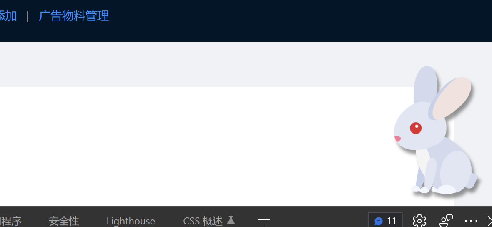

# rabbit

  

## 功能

把云间玉兔添加到你自己的网页内！支持自定义颜色、以及位置。

## 使用

首先需要引入模块，可以使用 CDN 直接引入或者通过 NPM 包的形式安装

```

<!-- https://cdn.jsdelivr.net/gh/zcxey2911/rabbit@v1.0.0/lib/rabbit.css -->
<!-- https://cdn.jsdelivr.net/gh/zcxey2911/rabbit@v1.0.0/lib/rabbit.js -->

<link
  rel="stylesheet"
  href="https://cdn.jsdelivr.net/gh/zcxey2911/rabbit@v1.0.0/lib/rabbit.css"
/>

<div id="rabbit_box">
</div>

<script>

function init_rabbit(){

 rabbit_init("pink","20%");  // 粉色 高度20%

 //rabbit_init(); //默认颜色 默认位置

}

</script>


<script
  async
  onload="init_rabbit()"
  src="https://cdn.jsdelivr.net/gh/zcxey2911/rabbit@v1.0.0/lib/rabbit.js"
></script>

```

OR

```
// npm install --save rabbit-widget
import 'rabbit-widget/lib/rabbit.css';

var rabbit_init = require('rabbit-widget');

rabbit_init();

```

## 注意事项

如果使用NPM导入模块的形式引入，请确保页面加载完毕之后执行再执行rabbit_init();，否则会报错：Uncaught TypeError: Cannot set properties of null (setting 'innerHTML')

以Vue.js3.0组件为例子：

```
<template>
  <a-layout class="layout">
    <a-layout-header>
      <div class="logo" />

      <ad_header />
      


    </a-layout-header>
    <a-layout-content style="padding: 0 50px">
      <a-breadcrumb style="margin: 16px 0">
        <a-breadcrumb-item>广告平台</a-breadcrumb-item>
        <a-breadcrumb-item>首页</a-breadcrumb-item>

      </a-breadcrumb>
      <div :style="{ background: '#fff', padding: '24px', minHeight: '280px' }">


        这里是首页


        <div id="rabbit_box"></div>


    </div>
    </a-layout-content>
    <a-layout-footer style="text-align: center">
      在线广告平台
    </a-layout-footer>
  </a-layout>
</template>

<script>

import ad_header from './ad_header';

import 'rabbit-widget/lib/rabbit.css';

var rabbit_init = require('rabbit-widget');


export default {
 data() {
    return {

     

    }
  },
  //声明子组件
  components:{

    'ad_header':ad_header


  },
  methods:{

   


  },
  created(){


    this.$nextTick(() => {
    console.log("页面加载完啦~")

    rabbit_init();
})


  }

}
</script>
<style>
.site-layout-content {
  min-height: 280px;
  padding: 24px;
  background: #fff;
}
#components-layout-demo-top .logo {
  float: left;
  width: 120px;
  height: 31px;
  margin: 16px 24px 16px 0;
  background: rgba(255, 255, 255, 0.3);
}
.ant-row-rtl #components-layout-demo-top .logo {
  float: right;
  margin: 16px 0 16px 24px;
}

[data-theme='dark'] .site-layout-content {
  background: #141414;
}
</style>
```
最终效果：
  


